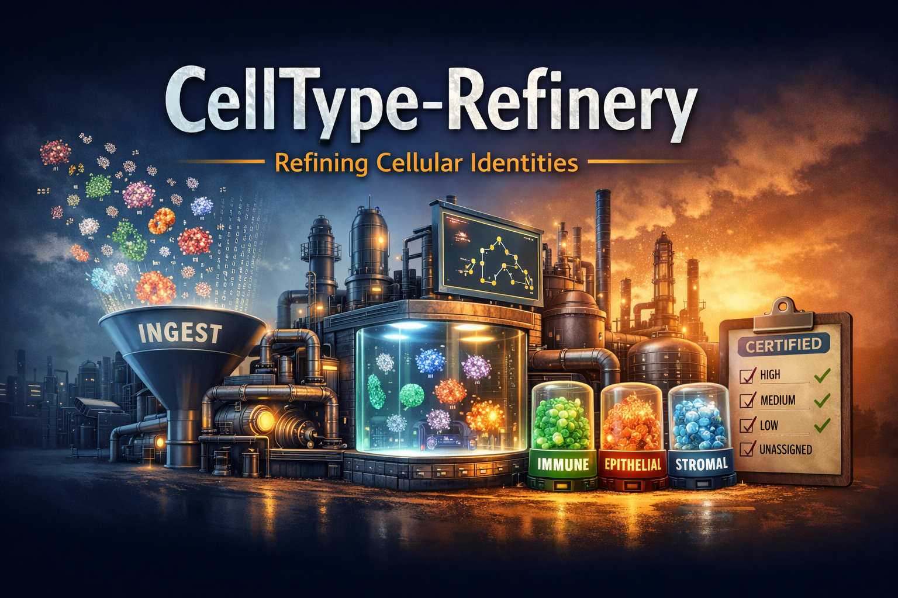

# CellType-Refinery



A comprehensive tool for cell-type annotation and refinement from spatial proteomics data.

## Features

- **Hierarchical Marker-Based Annotation**: Assign cell types using customizable marker panels with multi-level gating
- **Iterative Refinement**: Improve annotations through automatic and manual curation policies
- **Tissue-Agnostic Design**: Configure for any tissue type via YAML templates
- **Composition Analysis**: Cell-type statistics, diversity metrics, and regional enrichment
- **Spatial Analysis**: Neighborhood enrichment, Moran's I, and cell-type interactions
- **Quality Review**: Configurable flagging rules for annotation validation

## Installation

```bash
# From source
git clone https://github.com/kuang-da/CellType-Refinery.git
cd CellType-Refinery
pip install -e .

# With visualization support
pip install -e ".[viz]"

# With development dependencies
pip install -e ".[dev]"

# With all optional dependencies
pip install -e ".[all]"
```

## Quick Start

```python
from celltype_refinery.core.annotation import AnnotationEngine
from celltype_refinery.core.refinement import RefinementEngine
import scanpy as sc

# Load your data
adata = sc.read_h5ad("clustered_data.h5ad")

# Annotate with marker map
engine = AnnotationEngine(marker_map_path="markers.json")
result = engine.run(adata, output_dir="output/annotation")

# Refine annotations
refiner = RefinementEngine()
refiner.execute(adata, plan)
```

## CLI Usage

```bash
# Run full pipeline
celltype-refinery pipeline --config configs/pipelines/full.yaml

# Run individual stages
celltype-refinery cluster --input merged.h5ad --out output/clustered
celltype-refinery annotate --input output/clustered --marker-map markers.json
celltype-refinery refine --input output/annotated --auto --execute
celltype-refinery analyze --input output/refined --out output/analysis
```

## Configuration

CellType-Refinery uses YAML configuration files for tissue-specific parameters:

```yaml
# configs/tissues/my_tissue.yaml
version: "1.0"
tissue: "my_tissue"

gating:
  root_hard_requirements:
    "Immune Cells":
      marker: "CD45"
      min_pos_frac: 0.30

patterns:
  epithelial: ["Epithelium", "Epithelial"]
  immune: ["CD45", "Immune", "Myeloid"]
```

See `configs/tissues/template.yaml` for full configuration options.

## Package Structure

```
celltype_refinery/
├── core/
│   ├── preprocessing/    # Data loading, QC, normalization
│   ├── clustering/       # Leiden clustering
│   ├── annotation/       # Marker-based annotation
│   ├── refinement/       # Iterative refinement
│   ├── consolidation/    # Final label assignment
│   ├── composition/      # Composition statistics
│   ├── spatial/          # Spatial analysis
│   └── review/           # QC flagging
├── pipeline/             # Orchestration
├── io/                   # I/O utilities
├── viz/                  # Visualization
└── cli/                  # Command-line interface
```

## Documentation

- [Quickstart Guide](docs/quickstart.md)
- [Configuration Reference](docs/configuration.md)
- [API Documentation](docs/api/)

## License

MIT License

## Citation

If you use CellType-Refinery in your research, please cite:

```bibtex
@software{celltype_refinery,
  title = {CellType-Refinery: Cell-type annotation for spatial proteomics},
  year = {2025},
  url = {https://github.com/kuang-da/CellType-Refinery}
}
```
