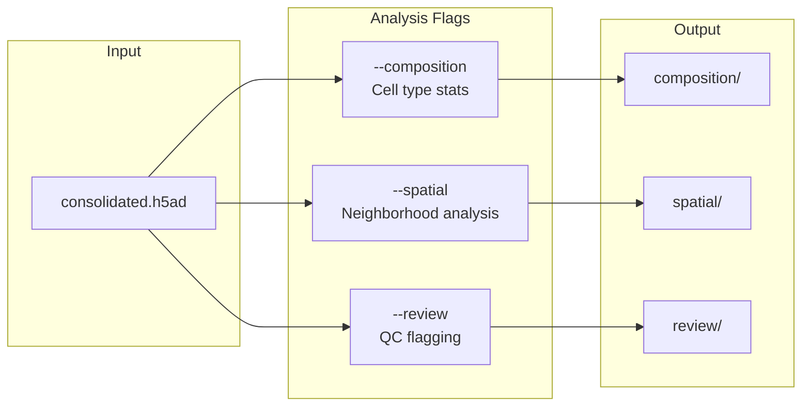

# analyze

Run composition and spatial analysis.



## Usage

```bash
celltype-refinery analyze [OPTIONS]
```

## Options

| Option | Type | Description |
|--------|------|-------------|
| `--input` | PATH | Input H5AD file |
| `--composition` | FLAG | Run composition |
| `--spatial` | FLAG | Run spatial |
| `--review` | FLAG | Run review |
| `--out` | PATH | Output directory |
