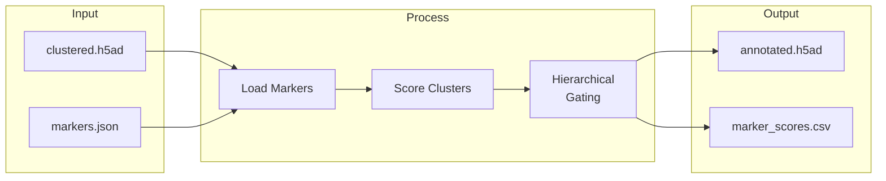

# annotate

Run marker-based annotation.



## Usage

```bash
celltype-refinery annotate [OPTIONS]
```

## Options

| Option | Type | Default | Description |
|--------|------|---------|-------------|
| `--input` | PATH | - | Input H5AD file |
| `--marker-map` | PATH | - | Marker map JSON |
| `--layer` | TEXT | batchcorr | Expression layer |
| `--min-coverage` | FLOAT | 0.3 | Minimum coverage |
| `--min-pos-frac` | FLOAT | 0.2 | Minimum positive fraction |
| `--out` | PATH | - | Output directory |
