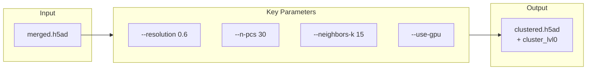

# cluster

Run Leiden clustering.



## Usage

```bash
celltype-refinery cluster [OPTIONS]
```

## Options

| Option | Type | Default | Description |
|--------|------|---------|-------------|
| `--input` | PATH | - | Input H5AD file |
| `--resolution` | FLOAT | 0.6 | Leiden resolution |
| `--n-pcs` | INT | 30 | Principal components |
| `--neighbors-k` | INT | 15 | k for k-NN |
| `--use-gpu` | FLAG | False | Use GPU |
| `--out` | PATH | - | Output directory |
