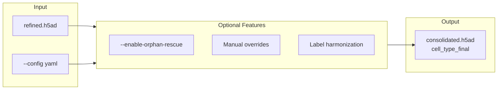

# consolidate

Run final consolidation.



## Usage

```bash
celltype-refinery consolidate [OPTIONS]
```

## Options

| Option | Type | Description |
|--------|------|-------------|
| `--input` | PATH | Input H5AD file |
| `--config` | PATH | Consolidation config |
| `--enable-orphan-rescue` | FLAG | Enable orphan rescue |
| `--out` | PATH | Output directory |
