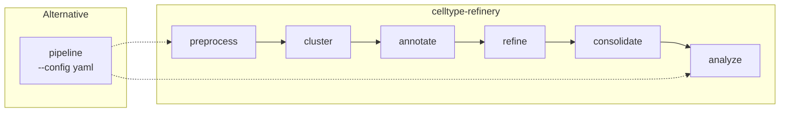

# CLI Overview

Command-line interface for CellType-Refinery.



## Installation

The CLI is installed with the package:

```bash
pip install -e .
celltype-refinery --help
```

## Commands

| Command | Description |
|---------|-------------|
| [preprocess](preprocess) | Run preprocessing stages |
| [cluster](cluster) | Leiden clustering |
| [annotate](annotate) | Marker-based annotation |
| [refine](refine) | Iterative refinement |
| [consolidate](consolidate) | Final consolidation |
| [analyze](analyze) | Composition and spatial |
| [pipeline](pipeline) | Full pipeline from config |

## Global Options

```bash
celltype-refinery --help
celltype-refinery --version
celltype-refinery --verbose COMMAND
celltype-refinery --debug COMMAND
```
