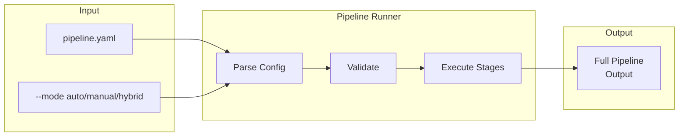

# pipeline

Run full pipeline from configuration.



## Usage

```bash
celltype-refinery pipeline [OPTIONS]
```

## Options

| Option | Type | Description |
|--------|------|-------------|
| `--config` | PATH | Pipeline configuration YAML |
| `--mode` | TEXT | Execution mode (auto, manual, hybrid) |
| `--dry-run` | FLAG | Show plan without executing |

## Example

```bash
celltype-refinery pipeline --config pipeline.yaml --mode auto
```
