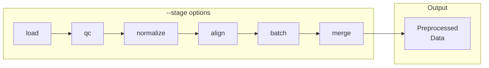

# preprocess

Run preprocessing stages.



## Usage

```bash
celltype-refinery preprocess [OPTIONS]
```

## Options

| Option | Type | Description |
|--------|------|-------------|
| `--input` | PATH | Input data directory |
| `--config` | PATH | Configuration file |
| `--out` | PATH | Output directory |
| `--stage` | TEXT | Specific stage to run |
