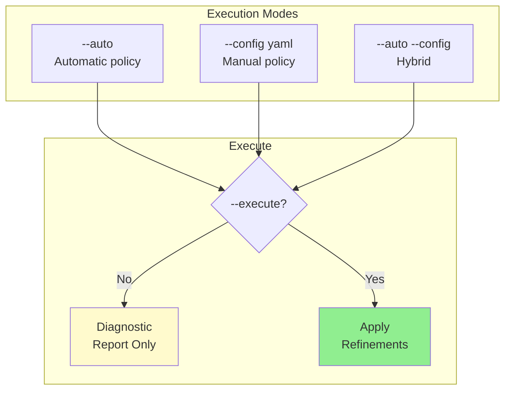

# refine

Run iterative refinement.



## Usage

```bash
celltype-refinery refine [OPTIONS]
```

## Options

| Option | Type | Default | Description |
|--------|------|---------|-------------|
| `--input` | PATH | - | Input H5AD file |
| `--auto` | FLAG | False | Enable auto policy |
| `--config` | PATH | - | Manual config YAML |
| `--execute` | FLAG | False | Execute refinement |
| `--score-threshold` | FLOAT | 1.0 | Score threshold |
| `--min-cells` | INT | 500 | Minimum cells |
| `--out` | PATH | - | Output directory |

## Examples

```bash
# Diagnostic mode
celltype-refinery refine --input annotated.h5ad --auto --out output/

# Execute mode
celltype-refinery refine --input annotated.h5ad --auto --execute --out output/

# Hybrid mode
celltype-refinery refine --input annotated.h5ad --auto --config curation.yaml --execute --out output/
```
