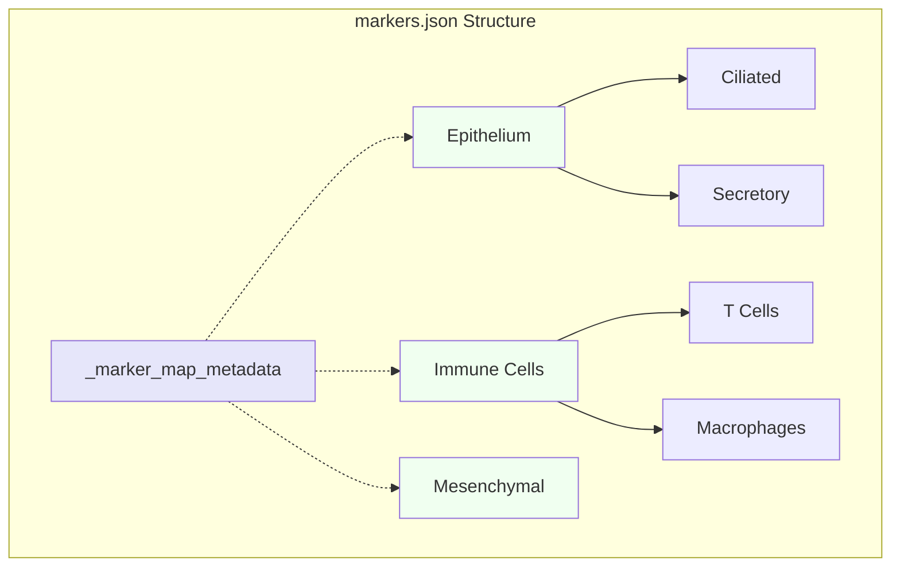

# Marker Maps

JSON files defining cell-type hierarchy and markers.



## Format

```json
{
  "_marker_map_metadata": {
    "version": "1.0",
    "tissue": "my_tissue",
    "description": "Description"
  },
  "Cell_Type": {
    "markers": ["Marker1", "Marker2"],
    "anti_markers": ["AntiMarker"],
    "subtypes": {}
  }
}
```

## Fields

See [Annotation: Marker Maps](../modules/annotation/marker-maps) for details.
