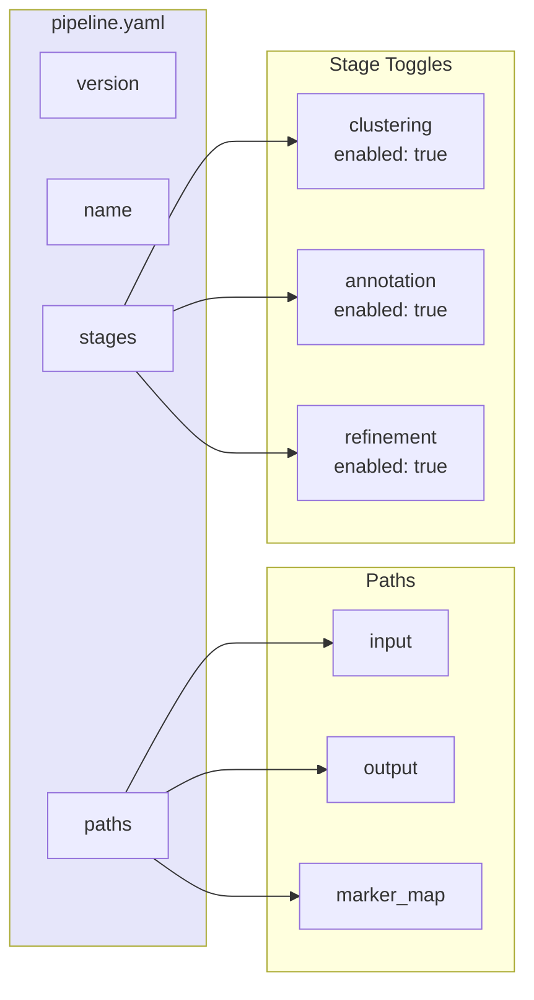

# Pipeline YAML

Configuration for full pipeline runs.



## Example

```yaml
version: "1.0"
name: "my_pipeline"

paths:
  input: "data/merged.h5ad"
  output: "output"
  marker_map: "markers.json"

stages:
  clustering:
    enabled: true
    resolution: 0.6
  annotation:
    enabled: true
  refinement:
    enabled: true
    mode: "auto"
```
