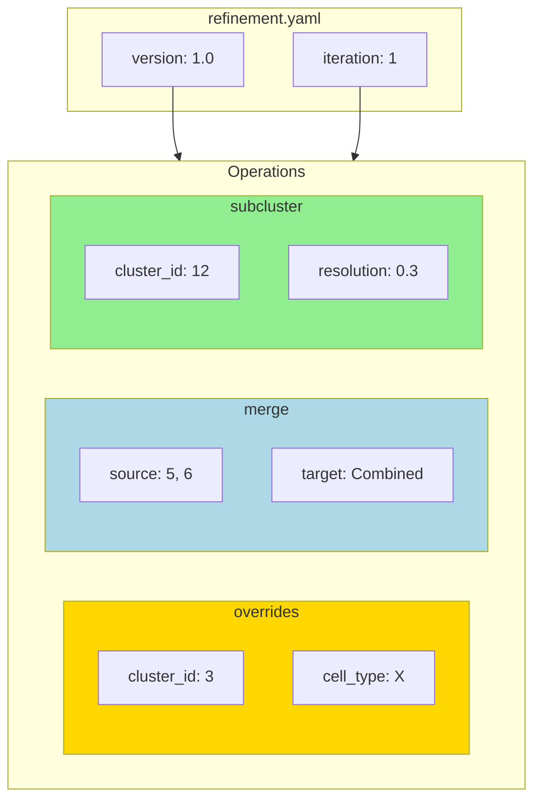

# Refinement YAML

Configuration for manual refinement.



## Example

```yaml
version: "1.0"
iteration: 1

overrides:
  - cluster_id: "3"
    cell_type: "My_Cell_Type"
    reason: "Explanation"

merge:
  - source_clusters: ["5", "6"]
    target_label: "Combined"
    reason: "Explanation"

subcluster:
  - cluster_id: "12"
    resolution: 0.3
    reason: "Explanation"
```
