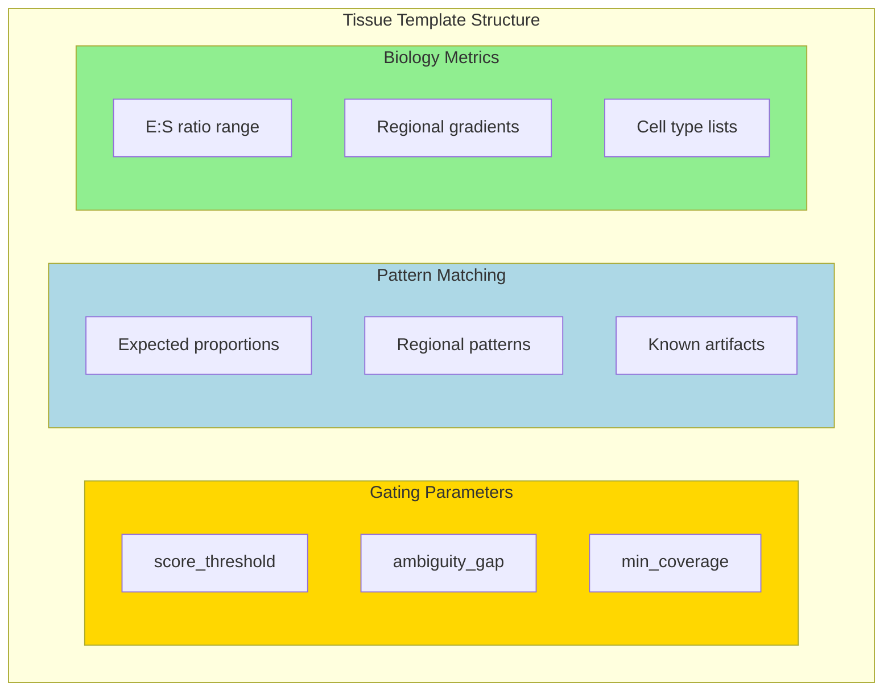

# Tissue Templates

YAML templates for tissue-specific configuration.

## Location

`configs/tissues/template.yaml`

## Sections

- Gating parameters
- Pattern matching
- Regional configuration
- Biology metrics
