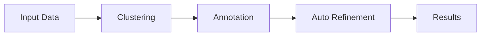

# Automated Workflow

The fully automated workflow provides a quick baseline annotation with minimal configuration.

## Overview



## When to Use

- Initial exploration of new datasets
- Benchmarking marker maps
- Quick turnaround requirements
- Well-characterized tissues

## CLI Usage

### Single Command

Run the full pipeline:

```bash
celltype-refinery pipeline \
  --config pipeline.yaml \
  --mode auto
```

### Step-by-Step

```bash
# 1. Cluster
celltype-refinery cluster \
  --input merged.h5ad \
  --resolution 0.6 \
  --out output/clustered

# 2. Annotate
celltype-refinery annotate \
  --input output/clustered/clustered.h5ad \
  --marker-map markers.json \
  --out output/annotated

# 3. Auto-refine
celltype-refinery refine \
  --input output/annotated/annotated.h5ad \
  --auto \
  --execute \
  --out output/refined

# 4. Analyze
celltype-refinery analyze \
  --input output/refined/refined.h5ad \
  --out output/analysis
```

## Python API

```python
from celltype_refinery.core.clustering import ClusteringEngine
from celltype_refinery.core.annotation import AnnotationEngine
from celltype_refinery.core.refinement import RefinementEngine
import scanpy as sc

# Load data
adata = sc.read_h5ad("merged.h5ad")

# Cluster
clusterer = ClusteringEngine(resolution=0.6)
clusterer.run(adata, output_dir="output/clustered")

# Annotate
annotator = AnnotationEngine(marker_map_path="markers.json")
annotator.run(adata, output_dir="output/annotated")

# Auto-refine
refiner = RefinementEngine()
refiner.load(adata)
plan = refiner.create_auto_plan(
    score_threshold=1.0,
    min_cells=500
)
refiner.execute(plan)

# Save
adata.write_h5ad("output/refined.h5ad")
```

## Auto-Refinement Criteria

The automatic policy identifies clusters for subclustering based on:

| Criterion | Threshold | Action |
|-----------|-----------|--------|
| Low score | \< 1.0 | Subcluster |
| Large cluster | \> 500 cells | Eligible |
| Heterogeneous DE | high variance | Subcluster |

### Score Calculation

```
score = mean_enrichment + mean_positive + de_bonus - anti_penalty
```

Where:
- `mean_enrichment`: Average expression of positive markers
- `mean_positive`: Fraction of cells expressing markers
- `de_bonus`: Bonus for markers in DE top genes
- `anti_penalty`: Penalty for anti-marker expression

## Output Review

After running, check the diagnostic report:

```python
import pandas as pd

# Load diagnostics
diag = pd.read_csv("output/refined/diagnostic_report.csv")

# Check recommendations
print(diag[["cluster_id", "recommendation", "score", "n_cells"]])

# Filter for subclustered
subclustered = diag[diag["recommendation"] == "SUBCLUSTER"]
print(f"Subclustered {len(subclustered)} clusters")
```

## Limitations

- May miss tissue-specific nuances
- Cannot incorporate domain knowledge
- Subclustering resolution is fixed
- May over-split or under-split

## Next Steps

If automated results need improvement:

- [Expert Curation](expert-curation) - Add manual corrections
- [Hybrid Workflow](hybrid-workflow) - Combine auto + manual
- [Iterative Refinement](iterative-refinement) - Multiple rounds
