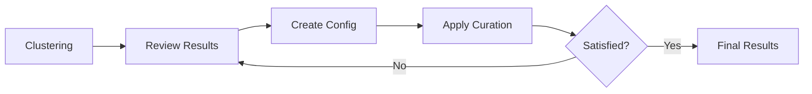

# Expert Curation Workflow

The expert curation workflow gives you full manual control over cell-type assignments.

## Overview



## When to Use

- Publication-quality annotations required
- Complex tissue with unusual populations
- Marker panel has known limitations
- Domain expertise available

## Step 1: Initial Clustering

Run clustering and annotation to see baseline results:

```bash
# Cluster
celltype-refinery cluster \
  --input merged.h5ad \
  --resolution 0.6 \
  --out output/clustered

# Annotate (no refinement)
celltype-refinery annotate \
  --input output/clustered/clustered.h5ad \
  --marker-map markers.json \
  --out output/annotated
```

## Step 2: Review Results

Examine the annotation results:

```python
import pandas as pd
import scanpy as sc

# Load data
adata = sc.read_h5ad("output/annotated/annotated.h5ad")
annotations = pd.read_csv("output/annotated/cluster_annotations.csv")

# Review annotations
print(annotations[["cluster_id", "assigned_label", "score", "stop_reason"]])

# Visualize marker expression
sc.pl.dotplot(adata, groupby="cluster_lvl0", var_names=["CD45", "EpCAM", "CD3"])
```

## Step 3: Create Curation Config

Create a YAML configuration with your corrections:

```yaml
# curation.yaml
version: "1.0"
iteration: 1
description: "Expert curation for my tissue"

# Direct label overrides
overrides:
  - cluster_id: "3"
    cell_type: "Ciliated_Epithelium"
    reason: "Clear FOXJ1/TUBB4A expression"

  - cluster_id: "7"
    cell_type: "Regulatory_T_Cells"
    reason: "CD3+FOXP3+ population"

# Merge over-split clusters
merge:
  - source_clusters: ["5", "6"]
    target_label: "Fibroblasts"
    reason: "Same marker profile, split by batch"

# Subcluster heterogeneous populations
subcluster:
  - cluster_id: "12"
    resolution: 0.3
    reason: "Mixed myeloid population"

# Relabel without re-clustering
relabel:
  - from_cluster: "8"
    to_label: "Smooth_Muscle_Cells"
    reason: "Misnamed in auto-annotation"
```

## Step 4: Apply Curation

Apply your configuration:

```bash
celltype-refinery refine \
  --input output/annotated/annotated.h5ad \
  --config curation.yaml \
  --execute \
  --out output/curated
```

## Step 5: Iterate

Review results and repeat if needed:

```python
# Load curated results
adata = sc.read_h5ad("output/curated/refined.h5ad")

# Check cell-type distribution
print(adata.obs["cell_type_curated"].value_counts())

# Verify specific corrections
cluster_3 = adata[adata.obs["cluster_lvl0"] == "3"]
print(f"Cluster 3 label: {cluster_3.obs['cell_type_curated'].iloc[0]}")
```

If further corrections needed, create `curation_v2.yaml` and apply:

```bash
celltype-refinery refine \
  --input output/curated/refined.h5ad \
  --config curation_v2.yaml \
  --execute \
  --out output/curated_v2
```

## Operation Types

### Override

Directly assign a cell type to a cluster:

```yaml
overrides:
  - cluster_id: "3"
    cell_type: "My_Cell_Type"
    reason: "Explanation"
```

### Merge

Combine multiple clusters:

```yaml
merge:
  - source_clusters: ["5", "6", "7"]
    target_label: "Combined_Type"
    reason: "Explanation"
```

### Subcluster

Re-cluster at finer resolution:

```yaml
subcluster:
  - cluster_id: "12"
    resolution: 0.3
    reason: "Explanation"
```

### Relabel

Rename without re-clustering:

```yaml
relabel:
  - from_cluster: "8"
    to_label: "New_Name"
    reason: "Explanation"
```

## Best Practices

1. **Document everything**: Always include `reason` fields
2. **Small iterations**: Make a few changes, verify, repeat
3. **Version configs**: Keep `curation.yaml`, `curation_v2.yaml`, etc.
4. **Preserve lineage**: Use cluster IDs, not cell-type names
5. **Review DE genes**: Check differential expression before overrides

## Audit Trail

All operations are logged in `curation_log.json`:

```json
{
  "timestamp": "2025-01-15T10:30:00",
  "operation": "override",
  "cluster_id": "3",
  "old_label": "Unknown",
  "new_label": "Ciliated_Epithelium",
  "reason": "Clear FOXJ1/TUBB4A expression",
  "n_cells": 5234
}
```

## Next Steps

- [Hybrid Workflow](hybrid-workflow) - Combine with automation
- [Refinement Operations](../modules/refinement/operations) - Detailed operation reference
