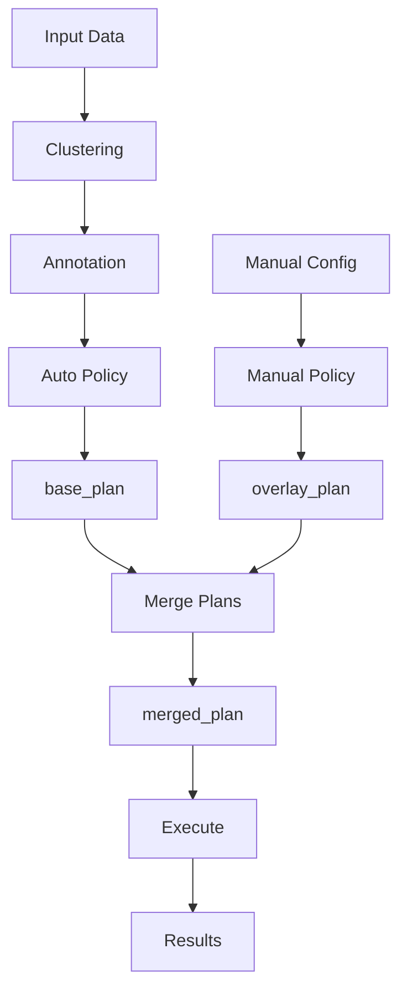
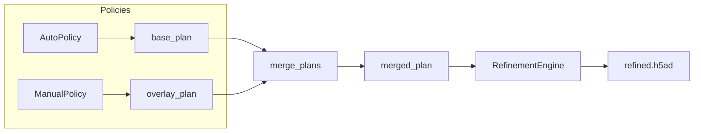

# Hybrid Workflow

The hybrid workflow combines automatic baseline annotation with targeted manual corrections.

## Overview



## When to Use

- You want automatic baseline with specific corrections
- Some cell types need manual attention
- You need reproducible, auditable results
- Time is limited but accuracy matters

## Architecture

The hybrid workflow uses a policy-based system:



**Merge Rule**: Manual operations override automatic ones for the same cluster.

## CLI Usage

```bash
# Run with both auto and manual config
celltype-refinery refine \
  --input annotated.h5ad \
  --auto \
  --config curation.yaml \
  --execute \
  --out output/hybrid
```

## Python API

```python
from celltype_refinery.core.refinement import RefinementEngine
from celltype_refinery.core.refinement.policies import AutoPolicy, ManualPolicy

# Load data
engine = RefinementEngine()
engine.load(adata)

# Create auto plan
auto_policy = AutoPolicy(score_threshold=1.0, min_cells=500)
base_plan = auto_policy.generate(engine.context)

# Create manual plan
manual_policy = ManualPolicy.from_yaml("curation.yaml")
overlay_plan = manual_policy.generate(engine.context)

# Merge plans (manual overrides auto)
merged_plan = engine.merge_plans(base_plan, overlay_plan)

# Execute
engine.execute(merged_plan)
```

## Example Configuration

### Auto Policy Defaults

The automatic policy generates:

- **SUBCLUSTER** for low-scoring clusters (score < 1.0)
- **SKIP** for high-confidence clusters (score > 1.0)
- **RELABEL** for leaf nodes with good scores

### Manual Overrides

Your config overrides auto decisions:

```yaml
# curation.yaml
version: "1.0"

# Override auto's SUBCLUSTER decision
overrides:
  - cluster_id: "5"
    cell_type: "Known_Rare_Type"
    reason: "Rare but well-characterized population"

# Force subcluster even if auto said SKIP
subcluster:
  - cluster_id: "8"
    resolution: 0.4
    reason: "Known to contain subtypes"

# Prevent auto from subclustering
skip:
  - cluster_id: "12"
    reason: "Low cells, do not subcluster"
```

## Merge Behavior

| Auto Decision | Manual Decision | Result |
|---------------|-----------------|--------|
| SUBCLUSTER | Override | Override wins |
| SUBCLUSTER | Skip | Skip wins |
| SKIP | Subcluster | Subcluster wins |
| SKIP | Override | Override wins |
| Any | Merge | Merge wins |

## Diagnostic Mode

Preview the merged plan before executing:

```bash
# Generate plan without executing
celltype-refinery refine \
  --input annotated.h5ad \
  --auto \
  --config curation.yaml \
  --out output/hybrid

# Review the plan
cat output/hybrid/merged_plan.yaml
```

```yaml
# merged_plan.yaml (generated)
operations:
  - type: override
    cluster_id: "5"
    cell_type: "Known_Rare_Type"
    source: manual  # Manual override

  - type: subcluster
    cluster_id: "3"
    resolution: 0.3
    source: auto  # From auto policy

  - type: subcluster
    cluster_id: "8"
    resolution: 0.4
    source: manual  # Manual forced

  - type: skip
    cluster_id: "12"
    source: manual  # Manual prevention
```

## Workflow Example

### Step 1: Run Auto + Diagnostic

```bash
celltype-refinery refine \
  --input annotated.h5ad \
  --auto \
  --out output/auto_diagnostic
```

Review `diagnostic_report.csv` to see auto recommendations.

### Step 2: Create Manual Config

Based on review, create overrides:

```yaml
# curation.yaml
overrides:
  - cluster_id: "7"
    cell_type: "Regulatory_T_Cells"
    reason: "Confirmed by flow cytometry"

skip:
  - cluster_id: "15"
    reason: "Too few cells for subclustering"
```

### Step 3: Execute Hybrid

```bash
celltype-refinery refine \
  --input annotated.h5ad \
  --auto \
  --config curation.yaml \
  --execute \
  --out output/hybrid
```

### Step 4: Review and Iterate

```python
# Check results
import pandas as pd

log = pd.read_json("output/hybrid/curation_log.json")
print(log[["operation", "cluster_id", "source"]])
```

## Best Practices

1. **Start with auto**: Let automation handle straightforward cases
2. **Target overrides**: Only override where you have evidence
3. **Document reasons**: Future you will thank present you
4. **Review merged plan**: Check before executing
5. **Iterate incrementally**: Small changes, verify, repeat

## Next Steps

- [Iterative Refinement](iterative-refinement) - Multiple rounds
- [Policy Reference](../modules/refinement/policies) - Policy details
- [Operations Reference](../modules/refinement/operations) - Operation types
