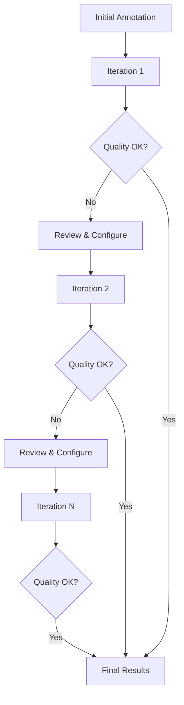

# Iterative Refinement Workflow

The iterative workflow enables multiple rounds of refinement for complex tissues.

## Overview



## When to Use

- Complex tissues with many cell types
- Unexpected populations discovered during annotation
- Need to explore different granularity levels
- Publication requiring thorough validation

## Iteration Tracking

Each iteration creates versioned outputs:

```
output/
├── iter1/
│   ├── refined.h5ad
│   ├── diagnostic_report.csv
│   └── curation_log.json
├── iter2/
│   ├── refined.h5ad
│   ├── diagnostic_report.csv
│   └── curation_log.json
└── iter3/
    └── ...
```

## CLI Workflow

### Iteration 1: Baseline

```bash
# Initial annotation
celltype-refinery annotate \
  --input clustered.h5ad \
  --marker-map markers.json \
  --out output/iter0

# First refinement round
celltype-refinery refine \
  --input output/iter0/annotated.h5ad \
  --auto \
  --execute \
  --out output/iter1
```

### Iteration 2+: Targeted Refinement

```bash
# Review iter1 results, create config
cat output/iter1/diagnostic_report.csv

# Apply targeted corrections
celltype-refinery refine \
  --input output/iter1/refined.h5ad \
  --config iter2_curation.yaml \
  --execute \
  --out output/iter2
```

### Continue Until Satisfied

```bash
# Iteration 3
celltype-refinery refine \
  --input output/iter2/refined.h5ad \
  --config iter3_curation.yaml \
  --execute \
  --out output/iter3

# ... and so on
```

## Python API

```python
from celltype_refinery.core.refinement import RefinementEngine
from pathlib import Path

def run_iteration(input_path, config_path, output_dir, iteration):
    """Run one refinement iteration."""
    import scanpy as sc

    adata = sc.read_h5ad(input_path)
    engine = RefinementEngine()
    engine.load(adata)

    if config_path:
        plan = engine.create_manual_plan(config_path)
    else:
        plan = engine.create_auto_plan()

    engine.execute(plan)

    out = Path(output_dir) / f"iter{iteration}"
    out.mkdir(parents=True, exist_ok=True)
    adata.write_h5ad(out / "refined.h5ad")

    return adata

# Run iterations
adata = run_iteration("annotated.h5ad", None, "output", 1)
adata = run_iteration("output/iter1/refined.h5ad", "iter2.yaml", "output", 2)
adata = run_iteration("output/iter2/refined.h5ad", "iter3.yaml", "output", 3)
```

## Stopping Criteria

Use the diagnostic report to decide when to stop:

```python
import pandas as pd

def check_stopping_criteria(diagnostic_path):
    """Check if refinement should continue."""
    diag = pd.read_csv(diagnostic_path)

    # Criteria
    unassigned_rate = (diag["assigned_label"] == "Unassigned").mean()
    low_confidence = (diag["confidence"] == "LOW").mean()
    subcluster_needed = (diag["recommendation"] == "SUBCLUSTER").sum()

    print(f"Unassigned rate: {unassigned_rate:.1%}")
    print(f"Low confidence: {low_confidence:.1%}")
    print(f"Clusters needing subcluster: {subcluster_needed}")

    # Stop if all criteria met
    if unassigned_rate < 0.10 and low_confidence < 0.15 and subcluster_needed == 0:
        print("Stopping criteria met!")
        return True
    return False

# Check after each iteration
check_stopping_criteria("output/iter2/diagnostic_report.csv")
```

## Lineage Tracking

CellType-Refinery tracks cell lineage across iterations:

```python
# Access lineage information
print(adata.obs["cell_lineage"].value_counts())

# Example lineage chain
# "0:1:2" means: cluster 0 → subcluster 1 → sub-subcluster 2
```

## Example: 3-Iteration Workflow

### Iteration 1: Auto Baseline

```yaml
# Auto-generated actions:
# - Subcluster 5 low-scoring clusters
# - Skip 28 high-confidence clusters
# - 1 cluster marked ambiguous
```

**Results**: 82% assigned, 18% unassigned

### Iteration 2: Target Unassigned

```yaml
# iter2_curation.yaml
subcluster:
  - cluster_id: "12:0"  # Unassigned subpopulation
    resolution: 0.4

overrides:
  - cluster_id: "12:1"
    cell_type: "Debris"
    reason: "Low complexity, high background"
```

**Results**: 89% assigned, 8% unassigned, 3% debris

### Iteration 3: Fine-tune

```yaml
# iter3_curation.yaml
merge:
  - source_clusters: ["5:0", "5:1"]
    target_label: "M1_Macrophages"
    reason: "Oversplit, same profile"

relabel:
  - from_cluster: "8:2:1"
    to_label: "Activated_T_Cells"
```

**Results**: 91% assigned (final)

## Best Practices

1. **Track iterations**: Keep all outputs, don't overwrite
2. **Document decisions**: Each config should have reasons
3. **Review incrementally**: Don't make too many changes at once
4. **Use diagnostics**: Let metrics guide your decisions
5. **Know when to stop**: Define criteria upfront

## Visualization

Track quality across iterations:

```python
import matplotlib.pyplot as plt

iterations = [1, 2, 3]
unassigned = [0.18, 0.08, 0.06]
low_conf = [0.25, 0.15, 0.10]

fig, ax = plt.subplots()
ax.plot(iterations, unassigned, 'o-', label='Unassigned')
ax.plot(iterations, low_conf, 's-', label='Low Confidence')
ax.set_xlabel('Iteration')
ax.set_ylabel('Rate')
ax.legend()
plt.savefig('iteration_progress.png')
```

## Next Steps

- [Diagnostic Mode](../modules/refinement/diagnostic-mode) - Understanding diagnostics
- [Consolidation](../modules/consolidation/overview) - Final label assignment
- [Review Module](../modules/review/overview) - Quality validation
