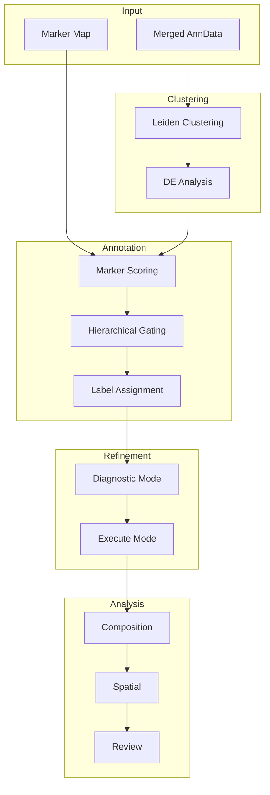

# Workflow Overview

CellType-Refinery supports multiple workflow patterns depending on your needs.

## Workflow Comparison

| Workflow | Use Case | Automation | Expert Input | Time |
|----------|----------|------------|--------------|------|
| [Automated](automated-workflow) | Initial baseline | High | None | Fast |
| [Expert Curation](expert-curation) | Publication-quality | Low | High | Slow |
| [Hybrid](hybrid-workflow) | Best of both | Medium | Medium | Medium |
| [Iterative](iterative-refinement) | Complex tissues | Variable | Variable | Variable |

## Choosing a Workflow

### Use Automated Workflow When:

- You need a quick baseline annotation
- Your tissue has well-characterized markers
- Cell-type boundaries are clear
- You're doing exploratory analysis

### Use Expert Curation When:

- Preparing publication-quality annotations
- Your marker panel has known limitations
- You have domain expertise to apply
- Accuracy is more important than speed

### Use Hybrid Workflow When:

- You want automatic baseline with targeted corrections
- Some cell types are straightforward, others need review
- You want reproducible results with audit trail

### Use Iterative Refinement When:

- Working with complex, heterogeneous tissues
- Initial annotation reveals unexpected populations
- You need to explore cell-type granularity

## Pipeline Stages

All workflows share these core stages:

## Common Parameters

### Clustering

| Parameter | Default | Description |
|-----------|---------|-------------|
| `resolution` | 0.6 | Leiden resolution (higher = more clusters) |
| `n_pcs` | 30 | Principal components for neighbors |
| `neighbors_k` | 15 | k for k-NN graph |

### Annotation

| Parameter | Default | Description |
|-----------|---------|-------------|
| `layer` | `batchcorr` | Expression layer to use |
| `min_coverage` | 0.3 | Minimum marker coverage |
| `min_pos_frac` | 0.2 | Minimum positive fraction |

### Refinement

| Parameter | Default | Description |
|-----------|---------|-------------|
| `score_threshold` | 1.0 | Score below which to subcluster |
| `min_cells` | 500 | Minimum cells for subclustering |

## Output Files

All workflows produce:

| File | Description |
|------|-------------|
| `*.h5ad` | AnnData with annotations |
| `cluster_annotations.csv` | Per-cluster summary |
| `marker_scores.csv` | Full scoring matrix |
| `mapping_table.csv` | Cluster to cell-type map |
| `curation_log.json` | Operation history |

## Next Steps

Choose your workflow:

- [Automated Workflow](automated-workflow) - Quick baseline
- [Expert Curation](expert-curation) - Manual control
- [Hybrid Workflow](hybrid-workflow) - Best of both
- [Iterative Refinement](iterative-refinement) - Complex tissues
