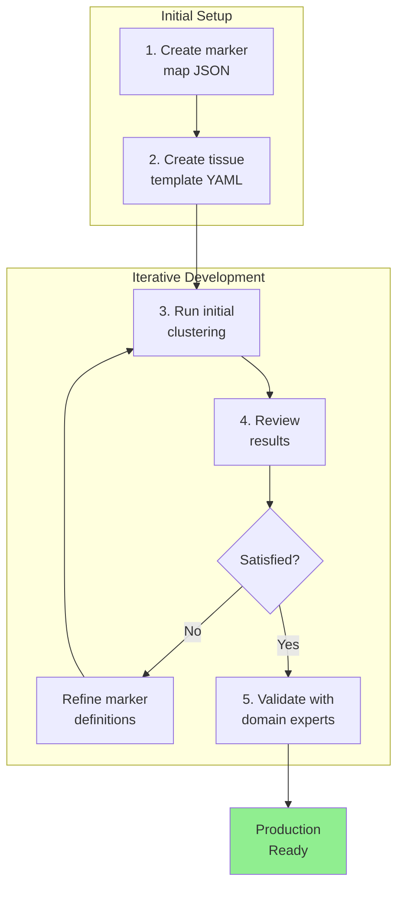

# Custom Tissue Example

How to configure CellType-Refinery for a new tissue.

## Steps

1. Create marker map JSON
2. Create tissue template YAML
3. Run initial clustering
4. Iterate on marker definitions
5. Validate with domain experts

## Tips

- Start with major lineages
- Add subtypes incrementally
- Use anti-markers to distinguish similar types
- Validate with known marker expression
