# Fallopian Tube Example

Example annotation workflow for fallopian tube tissue.

```mermaid
flowchart TD
    subgraph Data["Input: 3.4M cells, 45 markers"]
        D1[5 donors]
        D2[4 regions]
    end

    subgraph Workflow
        W1[Preprocessing<br/>+ Batch Correction] --> W2[Leiden<br/>res=0.6]
        W2 --> W3[FT Marker<br/>Map Annotation]
        W3 --> W4[Iterative<br/>Refinement ×3]
        W4 --> W5[Composition<br/>+ Spatial]
    end

    subgraph Results["Results"]
        R1["91% assigned"]
        R2["15 cell types"]
        R3["Regional patterns"]
    end

    D1 --> W1
    D2 --> W1
    W5 --> R1
    W5 --> R2
    W5 --> R3

    style Results fill:#90EE90
```

## Data

- 3.4M cells
- 45 markers
- 5 donors
- 4 regions (fimbriae, ampulla, isthmus, uterine junction)

## Workflow

1. Preprocessing with batch correction
2. Leiden clustering at resolution 0.6
3. Annotation with FT marker map
4. Iterative refinement (3 rounds)
5. Composition and spatial analysis

## Results

- 91% assignment rate
- 15 final cell types
- Clear regional patterns
