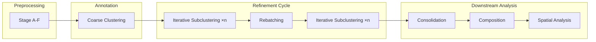
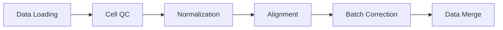
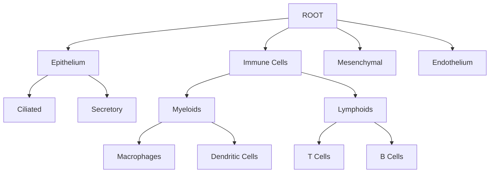

# CellType-Refinery

A comprehensive toolkit for cell-type annotation and refinement from spatial proteomics data.

## Overview

CellType-Refinery is a Python package designed for processing multiplexed imaging data (CODEX, PhenoCycler, Imaging Mass Cytometry) through a multi-stage workflow. It provides hierarchical marker-based annotation, iterative refinement, and comprehensive downstream analysis.

## Pipeline Architecture



### Preprocessing Details



## Key Features

### Hierarchical Annotation

Assign cell types using customizable marker panels with multi-level gating. The system traverses a marker hierarchy, scoring each cell against defined marker sets and applying gating thresholds.



### Iterative Refinement

Improve annotations through automatic and manual curation policies. The refinement engine supports:

- **Subclustering**: Re-cluster ambiguous populations at finer resolution
- **Merging**: Combine over-split clusters
- **Overrides**: Manual corrections for known cell types
- **Relabeling**: Update labels without re-clustering

### Tissue-Agnostic Design

Configure CellType-Refinery for any tissue type via YAML templates and JSON marker maps. No code changes required to adapt to new tissues.

### Comprehensive Analysis

- **Composition**: Cell-type statistics, diversity metrics (Shannon, Simpson)
- **Spatial**: Neighborhood enrichment, Moran's I, cell-type interactions

## Quick Links

- [Installation](/docs/getting-started/installation) - Get CellType-Refinery installed
- [Quickstart](/docs/getting-started/quickstart) - Run your first annotation in 5 minutes
- [Core Workflows](/docs/core-workflows/workflow-overview) - Learn the main usage patterns
- [CLI Reference](/docs/cli/overview) - Command-line interface documentation

## Package Structure

```
celltype_refinery/
├── core/
│   ├── preprocessing/    # Data loading, QC, normalization
│   ├── clustering/       # Leiden clustering
│   ├── annotation/       # Marker-based annotation
│   ├── refinement/       # Iterative refinement
│   ├── consolidation/    # Final label assignment
│   ├── composition/      # Composition statistics
│   ├── spatial/          # Spatial analysis
│   └── review/           # QC flagging
├── pipeline/             # Orchestration
├── io/                   # I/O utilities
├── viz/                  # Visualization
└── cli/                  # Command-line interface
```
