# Annotation Exports

Output files from the annotation module.

```mermaid
flowchart TD
    subgraph Process["Annotation Process"]
        A[Annotation<br/>Engine]
    end

    subgraph Outputs["Output Files"]
        B[annotated.h5ad<br/>AnnData with labels]
        C[cluster_annotations.csv<br/>Per-cluster summary]
        D[marker_scores.csv<br/>Full scoring matrix]
        E[mapping_table.csv<br/>Cluster → Cell Type]
    end

    A --> B
    A --> C
    A --> D
    A --> E

    style B fill:#E6E6FA
    style C fill:#F0FFF0
    style D fill:#F0FFF0
    style E fill:#F0FFF0
```

## Files

| File | Description |
|------|-------------|
| `annotated.h5ad` | AnnData with labels |
| `cluster_annotations.csv` | Per-cluster summary |
| `marker_scores.csv` | Full scoring matrix |
| `mapping_table.csv` | Cluster to cell-type map |
