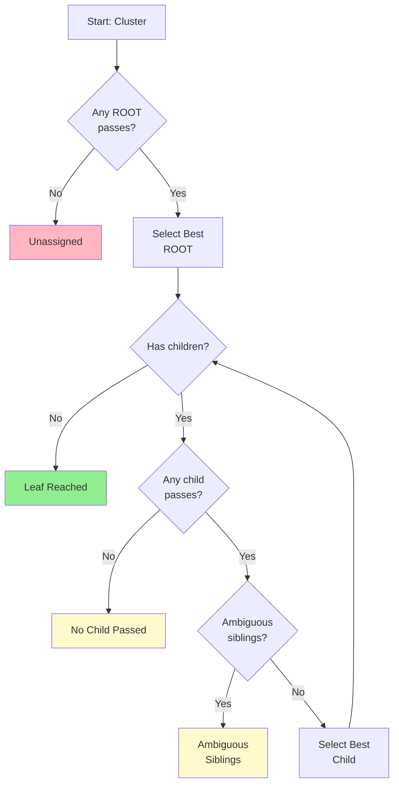

# Hierarchical Gating

Top-down traversal through the marker hierarchy.



## Algorithm

1. Find best passing ROOT (score > threshold)
2. Descend: compare SIBLINGS at each level
3. Stop when: leaf reached, no child passes, or ambiguous

## Stop Reasons

| Reason | Description |
|--------|-------------|
| `leaf_reached` | Deepest annotation |
| `ambiguous_siblings` | Close scores |
| `no_child_passed` | Stopped mid-hierarchy |
| `no_root_passed` | Unassigned |

## Scoring Formula

```
score = mean_enrichment + mean_positive + de_bonus - anti_penalty
```
