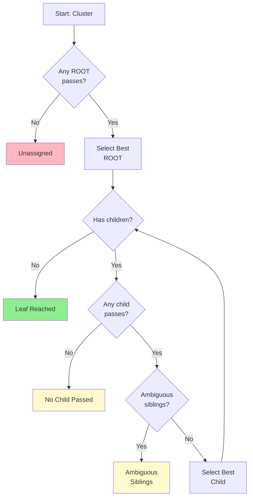

# Hierarchical Gating

Top-down traversal through the marker hierarchy.

:::info Full Algorithm Details
For complete gate checks and pseudocode, see [Hierarchical Gating Algorithm](/docs/methodology/hierarchical-gating-algorithm.md).
:::



## Algorithm

1. Find best passing ROOT (score > threshold)
2. Descend: compare SIBLINGS at each level
3. Stop when: leaf reached, no child passes, or ambiguous

## Stop Reasons

| Reason | Description | What to Do |
|--------|-------------|------------|
| `leaf_reached` | Best case - deepest level achieved | None needed |
| `ambiguous_siblings` | Top 2 scores too close to distinguish | Consider Stage I refinement |
| `no_child_passed` | All children failed gate threshold | Check marker coverage for children |
| `no_root_passed` | No root type fit the cluster | Check panel coverage, lower thresholds |
| `ambiguous_root` | Top 2 root scores too close | Check root-level marker definitions |

## Scoring Formula

```
score = mean_enrichment + mean_positive + de_bonus - anti_penalty
```

## Base Gating Parameters

Default thresholds vary by hierarchy depth to allow stricter gating at higher levels:

| Level | Depth | Base Threshold | Ambiguity Gap | Description |
|-------|-------|----------------|---------------|-------------|
| 0 | Root | 1.0 | 0.3 | Major lineages (Immune, Epithelial) |
| 1 | Class | 0.8 | 0.25 | Cell classes (T cell, B cell) |
| 2 | Subclass | 0.6 | 0.2 | Subtypes (CD4+, CD8+) |
| 3+ | Leaf | 0.4 | 0.15 | Terminal states (Treg, Th17) |

## CLI

```bash
celltype-refinery annotate gate \
  --input scored.h5ad \
  --hierarchy markers.json \
  --out output/gated.h5ad
```

### Common Options

```bash
# Lower root threshold for permissive gating
celltype-refinery annotate gate \
  --input scored.h5ad \
  --hierarchy markers.json \
  --root-threshold 0.8 \
  --out output/gated.h5ad

# Tighten ambiguity gap
celltype-refinery annotate gate \
  --input scored.h5ad \
  --hierarchy markers.json \
  --ambiguity-gap 0.4 \
  --out output/gated.h5ad
```

## See Also

- [Hierarchical Gating Algorithm](/docs/methodology/hierarchical-gating-algorithm.md) - Complete pseudocode and gate checks
- [Marker Scoring](./marker-scoring.md) - How scores are calculated
- [Tuning Guide](/docs/methodology/tuning-guide.md) - Threshold adjustment strategies
- [Marker Maps Configuration](/docs/configuration/marker-maps.md) - Hierarchy structure specification
