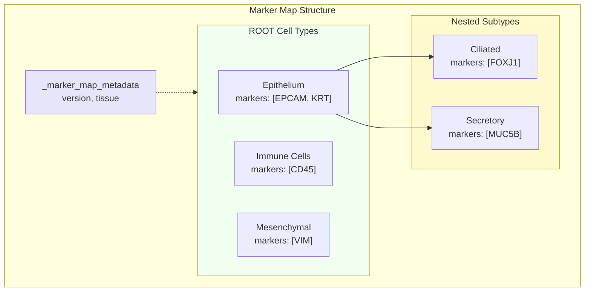

# Marker Maps

JSON files defining the cell-type hierarchy and markers.



## Format

```json
{
  "_marker_map_metadata": {
    "version": "1.0",
    "tissue": "my_tissue"
  },
  "Cell_Type": {
    "markers": ["Marker1", "Marker2"],
    "anti_markers": ["AntiMarker"],
    "subtypes": {
      "Subtype_A": {
        "markers": ["SubMarker1"]
      }
    }
  }
}
```

## Fields

| Field | Required | Description |
|-------|----------|-------------|
| `markers` | Yes | Positive markers |
| `anti_markers` | No | Negative markers |
| `subtypes` | No | Child cell types |
