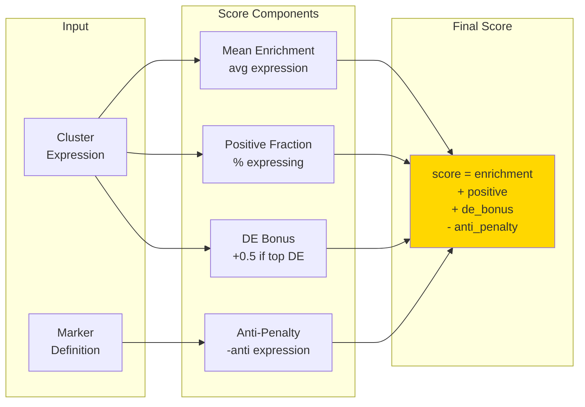

# Marker Scoring

Calculate marker expression scores per cluster.



## Components

- **Mean Enrichment**: Average marker expression
- **Positive Fraction**: Cells expressing marker
- **DE Bonus**: Markers in top DE genes
- **Anti-Penalty**: Anti-marker expression

## CLI

```bash
celltype-refinery annotate score \
  --input clustered.h5ad \
  --marker-map markers.json \
  --out output/scores.csv
```
