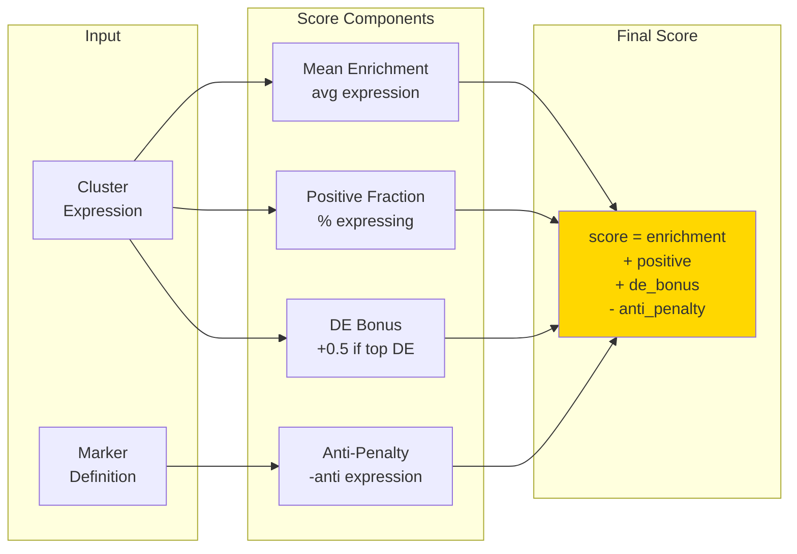

# Marker Scoring

Calculate marker expression scores per cluster.

:::info Full Algorithm Details
For the complete scoring formula with worked examples, see [Marker Scoring Algorithm](/docs/methodology/marker-scoring-algorithm.md).
:::



## Scoring Formula

The final marker score combines four components:

```
score = mean_enrichment + mean_positive + de_component - anti_penalty
```

## Components

- **Mean Enrichment**: Z-score of cluster mean expression versus global median. Measures how strongly a cluster expresses the marker compared to the dataset average.

- **Mean Positive Fraction**: Percentage of cells in the cluster with expression above the Q75 threshold. Captures the fraction of cells actively expressing the marker.

- **DE Component**: Rank-weighted bonus for markers appearing in the top-K differentially expressed genes. Rewards markers that are cluster-specific.

- **Anti-Penalty**: Penalty applied when a cluster expresses markers that conflict with the target cell type. Uses a hard gate at 1.0 to strongly penalize inappropriate expression.

## Key Parameters

| Parameter | Default | Effect |
|-----------|---------|--------|
| `positive_quantile` | 0.75 | Threshold percentile for counting a cell as "positive" |
| `de_bonus` | 0.5-0.6 | Maximum contribution from DE gene membership |
| `anti_weight` | 0.5-0.8 | Scaling factor for anti-marker penalty |
| `anti_agg` | top2mean | Aggregation mode for multiple anti-markers |

## CLI

```bash
celltype-refinery annotate score \
  --input clustered.h5ad \
  --marker-map markers.json \
  --out output/scores.csv
```

### Common Options

```bash
# Adjust positive threshold
celltype-refinery annotate score \
  --input clustered.h5ad \
  --marker-map markers.json \
  --positive-quantile 0.80 \
  --out output/scores.csv

# Increase anti-marker penalty
celltype-refinery annotate score \
  --input clustered.h5ad \
  --marker-map markers.json \
  --anti-weight 0.8 \
  --out output/scores.csv
```

## See Also

- [Marker Scoring Algorithm](/docs/methodology/marker-scoring-algorithm.md) - Complete mathematical formulation
- [Hierarchical Gating](./hierarchical-gating.md) - How scores drive hierarchy traversal
- [Tuning Guide](/docs/methodology/tuning-guide.md) - Parameter adjustment strategies
- [Marker Maps Configuration](/docs/configuration/marker-maps.md) - Marker file format specification
