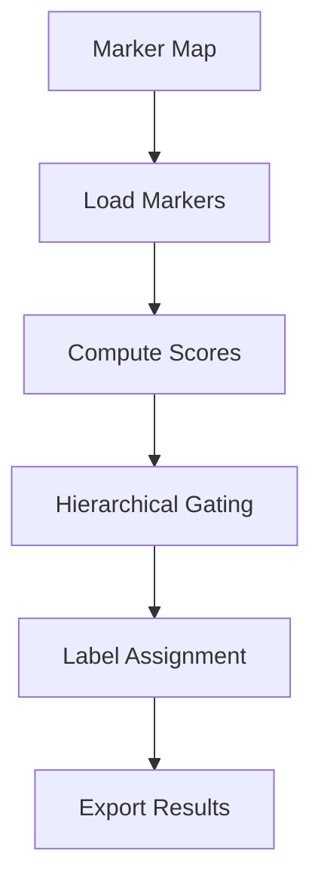

# Annotation Overview

The annotation module assigns cell types using hierarchical marker-based gating. It processes clustered single-cell data against a structured marker map to produce biologically meaningful cell type labels.

:::tip Deep Dive
For comprehensive algorithm details, see the [Methodology section](/docs/methodology/index.md):
- [Marker Scoring Algorithm](/docs/methodology/marker-scoring-algorithm.md) - Complete formula breakdown
- [Hierarchical Gating Algorithm](/docs/methodology/hierarchical-gating-algorithm.md) - Assignment logic
:::

## Pipeline Overview

The annotation pipeline flows through several distinct stages, from loading marker definitions to exporting final results:

```text
┌─────────────────────────────────────────────────────────────────────────────┐
│                         ANNOTATION PIPELINE                                  │
├─────────────────────────────────────────────────────────────────────────────┤
│                                                                             │
│   Marker Map JSON ──┬──► Load & Resolve ──► Compute Scores ──► Assign      │
│                     │        Markers           per cluster     Labels       │
│   Clustered .h5ad ──┘                              │             │          │
│                                                    │             ▼          │
│                                                    │      ┌────────────┐    │
│                                                    │      │ Per-Cell   │    │
│                                                    │      │ Voting     │    │
│                                                    │      │ (evidence) │    │
│                                                    │      └────────────┘    │
│                                                    ▼             │          │
│                                              ┌─────────────┐     │          │
│                                              │ Export CSVs │◄────┘          │
│                                              │ + AnnData   │                │
│                                              └─────────────┘                │
└─────────────────────────────────────────────────────────────────────────────┘
```

## Architecture



## Key Components

The annotation module is organized into several interconnected components:

### Marker Loading (`marker_loading.py`)

Parses hierarchical JSON marker maps and prepares them for scoring. Key responsibilities:
- Parse nested JSON structure into internal hierarchy representation
- Resolve gene aliases to canonical names using the alias database
- Handle missing markers gracefully with warnings
- Validate marker map structure and report errors

### Marker Scoring (`scoring.py`)

Computes expression-based scores for each cluster against each cell type definition. The scoring combines multiple signals:
- **Enrichment score**: Log fold-change of expression vs. background
- **Positive fraction**: Percentage of cells expressing the marker above threshold
- **DE bonus**: Additional weight for differentially expressed markers
- **Anti-penalty**: Score reduction when anti-markers are expressed

### Hierarchical Gating (`gating.py`)

Implements top-down traversal through the cell type hierarchy:
- Start at root nodes (e.g., Immune, Stromal, Epithelial)
- At each level, check gate conditions before descending
- Apply minimum score thresholds at branch points
- Track path through hierarchy for audit purposes

### Label Assignment (`assignment.py`)

Maps the winning cell type label from each cluster to individual cells:
- Propagate cluster-level labels to all cells in each cluster
- Store both the label and confidence score in `adata.obs`
- Record the full hierarchical path for each assignment

### Per-Cell Voting

Collects evidence at the single-cell level for ambiguous clusters:
- Aggregates marker evidence across individual cells
- Provides additional confidence metrics for borderline cases
- **Important**: Does NOT override cluster-level labels; serves as supplementary evidence only

### Export (`export.py`)

Generates output files for downstream analysis and review:
- CSV files with cluster-to-label mappings
- Audit cards summarizing evidence for each assignment
- Review checklists highlighting low-confidence annotations
- Updated AnnData object with annotations in `.obs`

## Quick Reference

### Key Parameters

| Parameter | Default | Description |
|-----------|---------|-------------|
| `--min-score` | 0.3 | Minimum composite score to accept a cell type assignment |
| `--min-positive-frac` | 0.1 | Minimum fraction of cells expressing marker |
| `--anti-weight` | 0.5 | Penalty multiplier for anti-marker expression |
| `--de-bonus` | 0.2 | Bonus added for differentially expressed markers |
| `--gate-threshold` | 0.5 | Score threshold for passing hierarchical gates |
| `--resolve-aliases` | true | Whether to resolve gene aliases automatically |

### Output Files

| File | Description |
|------|-------------|
| `cluster_labels.csv` | Cluster ID to cell type mapping |
| `cell_annotations.csv` | Per-cell annotations with confidence |
| `audit_cards.json` | Detailed evidence for each assignment |
| `review_checklist.csv` | Low-confidence annotations for manual review |
| `annotated.h5ad` | Full AnnData with annotations |

## CLI Usage

### Basic Command

```bash
celltype-refinery annotate \
  --input clustered.h5ad \
  --marker-map markers.json \
  --out output/annotated
```

### Common Options

```bash
celltype-refinery annotate \
  --input clustered.h5ad \
  --marker-map markers.json \
  --out output/annotated \
  --min-score 0.25 \
  --min-positive-frac 0.15 \
  --anti-weight 0.6 \
  --gate-threshold 0.4 \
  --cluster-key leiden_1.0 \
  --resolve-aliases \
  --export-audit-cards \
  --verbose
```

### Parameter Descriptions

- `--input`: Path to clustered AnnData file (.h5ad)
- `--marker-map`: Path to hierarchical marker map JSON
- `--out`: Output directory prefix
- `--min-score`: Lower values increase sensitivity but may reduce specificity
- `--min-positive-frac`: Adjust based on expected dropout rate in your data
- `--anti-weight`: Higher values more strongly penalize anti-marker expression
- `--cluster-key`: Column in `adata.obs` containing cluster assignments
- `--resolve-aliases`: Enable automatic gene alias resolution
- `--export-audit-cards`: Generate detailed evidence files for review
- `--verbose`: Enable detailed logging output

## See Also

### Module Documentation
- [Marker Scoring](./marker-scoring.md) - Detailed scoring methodology and configuration
- [Hierarchical Gating](./hierarchical-gating.md) - Gate logic and traversal strategies
- [Exports](./exports.md) - Output file formats and customization

### Methodology Reference
- [Marker Scoring Algorithm](/docs/methodology/marker-scoring-algorithm.md) - Complete mathematical formulation
- [Hierarchical Gating Algorithm](/docs/methodology/hierarchical-gating-algorithm.md) - Formal algorithm specification

### Related Guides
- [Tuning Guide](/docs/methodology/tuning-guide.md) - Parameter optimization strategies
- [Marker Maps Configuration](/docs/configuration/marker-maps.md) - JSON schema and examples
