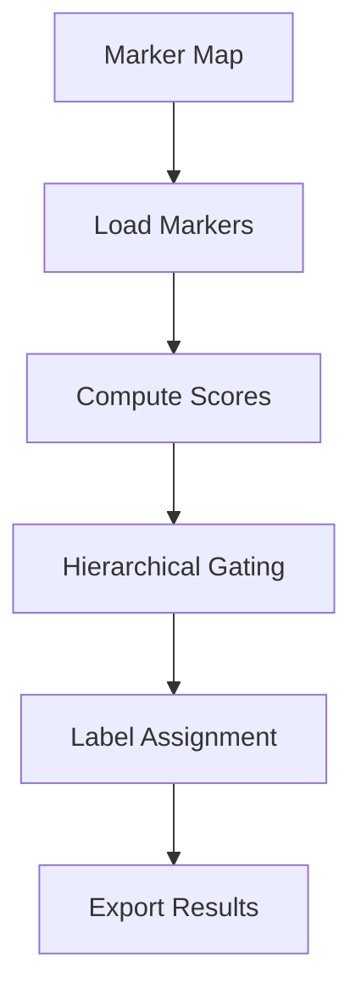

# Annotation Overview

The annotation module assigns cell types using hierarchical marker-based gating.

## Architecture



## Key Components

- **Marker Loading**: Parse hierarchical JSON marker maps
- **Marker Scoring**: Calculate expression scores per cluster
- **Hierarchical Gating**: Top-down traversal through hierarchy
- **Label Assignment**: Assign best-matching cell type

## CLI

```bash
celltype-refinery annotate \
  --input clustered.h5ad \
  --marker-map markers.json \
  --out output/annotated
```
