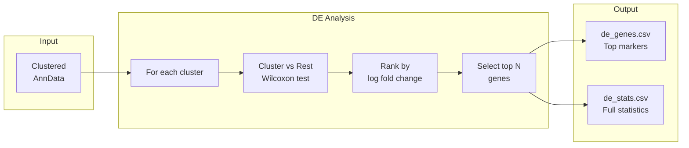

# Differential Expression

Identify cluster-specific markers via DE analysis.



## Method

Wilcoxon rank-sum test per cluster vs. rest.

## Output

- `de_genes.csv`: Top DE genes per cluster
- `de_stats.csv`: Full statistics

## CLI

```bash
celltype-refinery cluster de \
  --input clustered.h5ad \
  --n-genes 50 \
  --out output/
```
