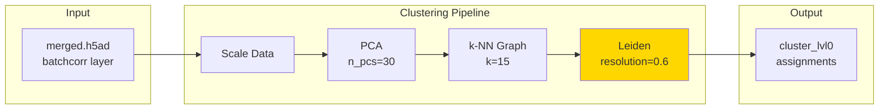

# Leiden Clustering

Community detection using the Leiden algorithm.



## Algorithm

1. Compute PCA embeddings
2. Build k-NN graph
3. Run Leiden clustering
4. Assign cluster labels

## GPU Acceleration

GPU-accelerated Leiden via RAPIDS is non-deterministic. Cluster counts may vary between runs.

## CLI

```bash
celltype-refinery cluster leiden \
  --input merged.h5ad \
  --resolution 0.6 \
  --use-gpu \
  --out output/
```
