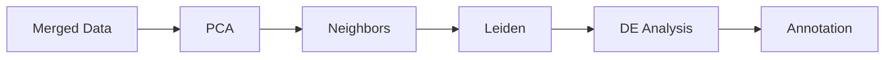

# Clustering Overview

The clustering module performs Leiden clustering and differential expression analysis.

## Pipeline Position



## CLI

```bash
celltype-refinery cluster \
  --input merged.h5ad \
  --resolution 0.6 \
  --n-pcs 30 \
  --out output/clustered
```

## Key Parameters

| Parameter | Default | Description |
|-----------|---------|-------------|
| `resolution` | 0.6 | Leiden resolution |
| `n_pcs` | 30 | Principal components |
| `neighbors_k` | 15 | k for k-NN graph |
| `use_gpu` | false | GPU acceleration |
