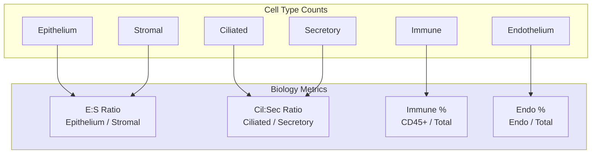

# Biology Metrics

Tissue-specific biological metrics.

```mermaid
flowchart TD
    subgraph CellCounts["Cell Type Counts"]
        EPI[Epithelium]
        STR[Stromal]
        IMM[Immune]
        END[Endothelium]
        CIL[Ciliated]
        SEC[Secretory]
    end

    subgraph Ratios["Biology Metrics"]
        R1["E:S Ratio<br/>Epithelium / Stromal"]
        R2["Cil:Sec Ratio<br/>Ciliated / Secretory"]
        R3["Immune %<br/>CD45+ / Total"]
        R4["Endo %<br/>Endo / Total"]
    end

    EPI --> R1
    STR --> R1
    CIL --> R2
    SEC --> R2
    IMM --> R3
    END --> R4

    style Ratios fill:#E6E6FA
```

## Metrics

- Epithelial:Stromal ratio
- Ciliated:Secretory ratio
- Immune infiltration
- Endothelial percentage
