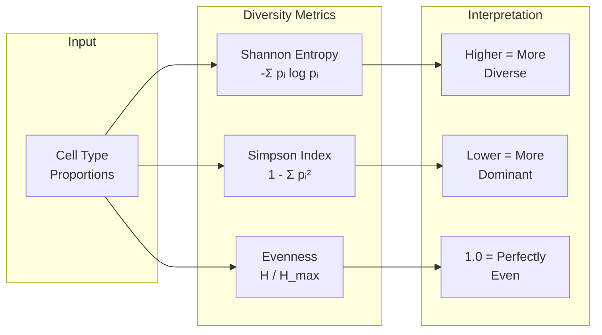

# Diversity Metrics

Quantify cell-type diversity.

## Metrics

| Metric | Formula | Interpretation |
|--------|---------|----------------|
| Shannon | -Σ pᵢ log pᵢ | Overall diversity |
| Simpson | 1 - Σ pᵢ² | Dominance inverse |
| Evenness | H / H_max | Distribution equality |
