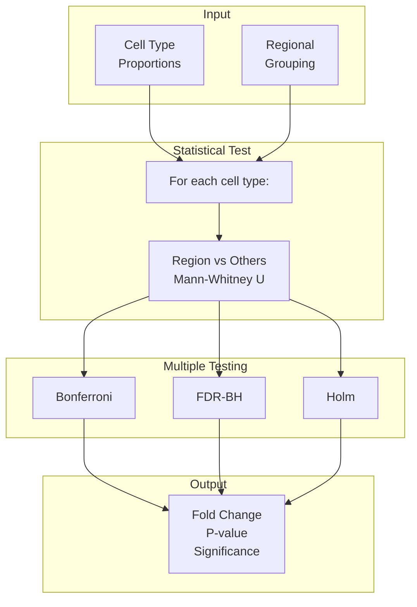

# Regional Enrichment

Test for regional enrichment of cell types.

```mermaid
flowchart TD
    subgraph Input
        A[Cell Type<br/>Proportions]
        B[Regional<br/>Grouping]
    end

    subgraph Test["Statistical Test"]
        C["For each cell type:"]
        D["Region vs Others<br/>Mann-Whitney U"]
    end

    subgraph Correction["Multiple Testing"]
        E[Bonferroni]
        F[FDR-BH]
        G[Holm]
    end

    subgraph Output
        H["Fold Change<br/>P-value<br/>Significance"]
    end

    A --> C
    B --> C
    C --> D
    D --> E
    D --> F
    D --> G
    E --> H
    F --> H
    G --> H
```

## Method

Mann-Whitney U test per cell type per region.

## Correction

- Bonferroni
- FDR-BH
- Holm
