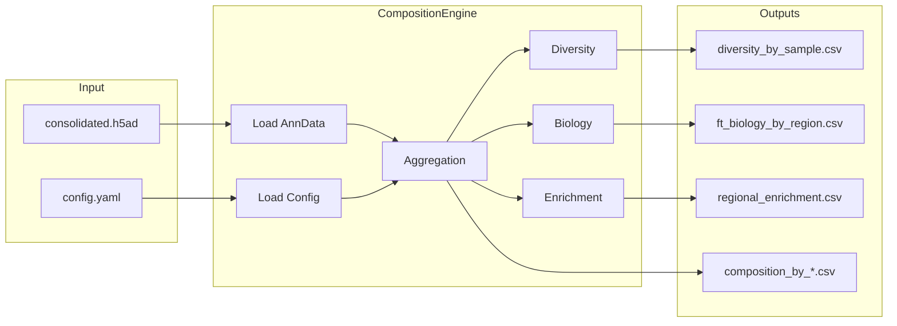
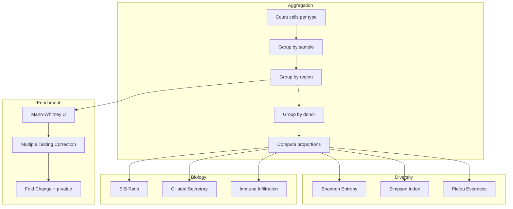

# Composition Overview

The composition module computes cell-type statistics, diversity metrics, and tissue-specific biology metrics from annotated single-cell data.

## Module Architecture

## Analysis Pipeline

## Features

- **Composition by sample/region/donor**: Hierarchical aggregation of cell-type counts and proportions
- **Diversity metrics**: Shannon entropy, Simpson index, Pielou's evenness per sample
- **FT biology metrics**: Epithelial:stromal ratio, ciliated:secretory ratio, immune infiltration
- **Regional enrichment tests**: Mann-Whitney U tests with Bonferroni/FDR correction
