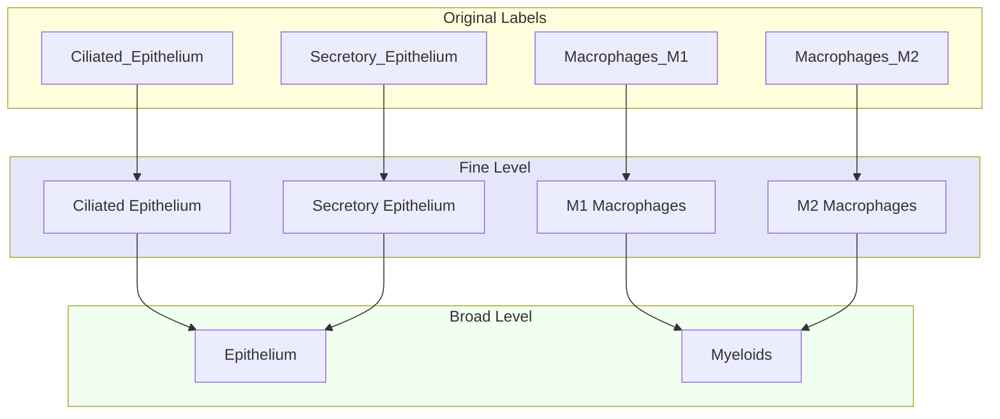

# Label Harmonization

Harmonize labels to standard vocabulary.

```mermaid
flowchart TD
    subgraph Input["Original Labels"]
        A["Ciliated_Epithelium"]
        B["Secretory_Epithelium"]
        C["Macrophages_M1"]
        D["Macrophages_M2"]
    end

    subgraph Fine["Fine Level"]
        F1["Ciliated Epithelium"]
        F2["Secretory Epithelium"]
        F3["M1 Macrophages"]
        F4["M2 Macrophages"]
    end

    subgraph Broad["Broad Level"]
        BR1["Epithelium"]
        BR2["Myeloids"]
    end

    A --> F1
    B --> F2
    C --> F3
    D --> F4

    F1 --> BR1
    F2 --> BR1
    F3 --> BR2
    F4 --> BR2

    style Fine fill:#E6E6FA
    style Broad fill:#F0FFF0
```

## Levels

- **Fine**: Detailed cell types
- **Broad**: Major categories
