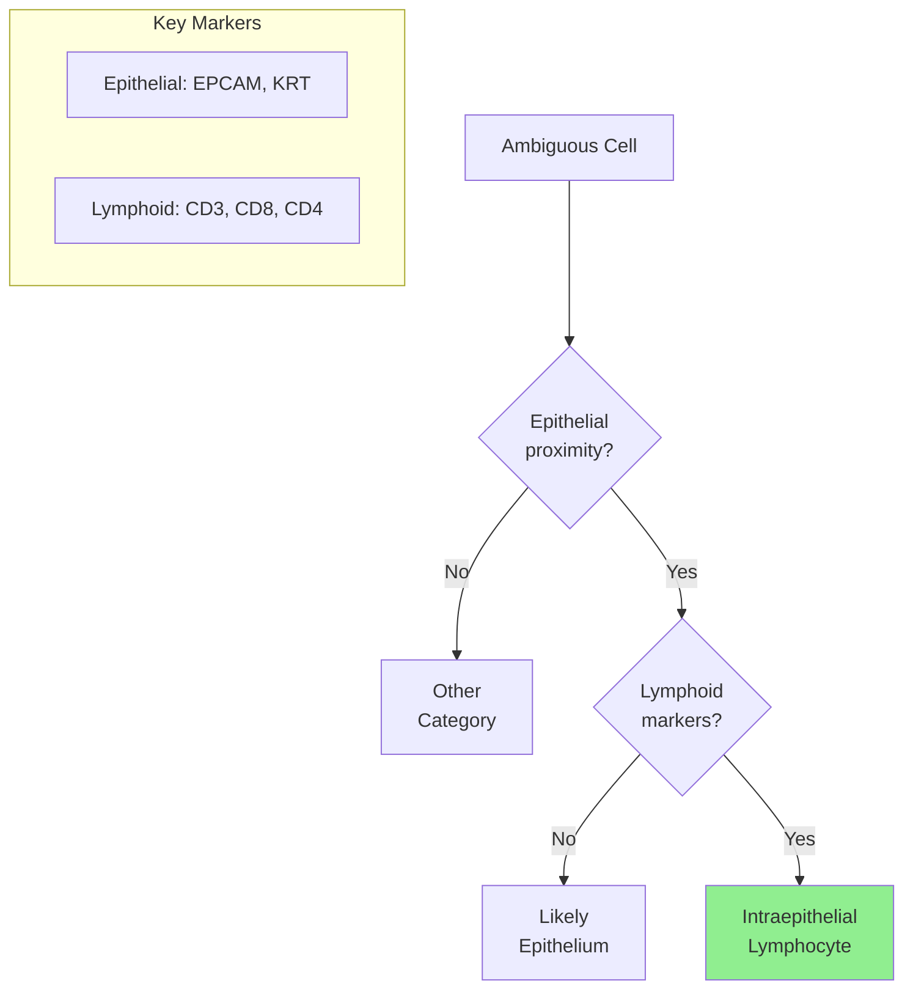

# IEL Rescue

Rescue intraepithelial lymphocytes.

```mermaid
flowchart TD
    A[Ambiguous Cell] --> B{Epithelial<br/>proximity?}
    B -->|No| OTHER[Other<br/>Category]
    B -->|Yes| C{Lymphoid<br/>markers?}

    C -->|No| EPI[Likely<br/>Epithelium]
    C -->|Yes| IEL[Intraepithelial<br/>Lymphocyte]

    subgraph Markers["Key Markers"]
        M1[Epithelial: EPCAM, KRT]
        M2[Lymphoid: CD3, CD8, CD4]
    end

    style IEL fill:#90EE90
```

## Logic

Cells that express both epithelial proximity markers and lymphoid markers may be IELs rather than unassigned.
