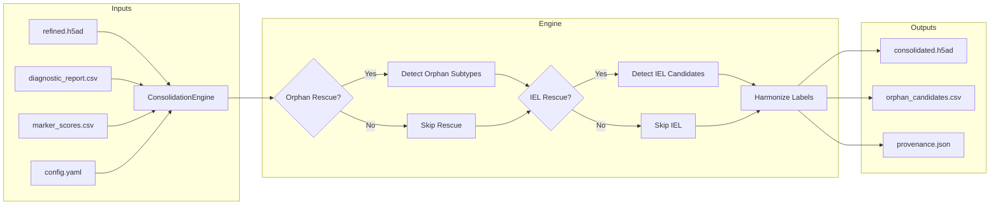
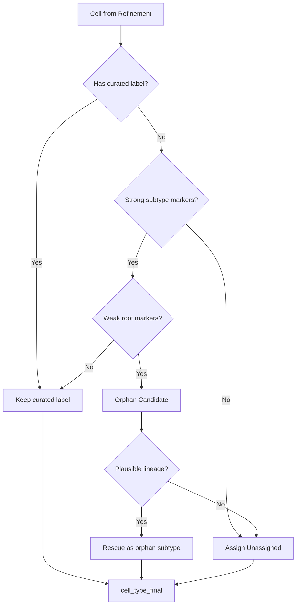

# Consolidation Overview

The consolidation module finalizes cell-type annotations after iterative refinement, producing a single `cell_type_final` column with production-ready labels.

## Module Architecture

## Decision Flow

## Features

- **Single output column**: `cell_type_final` with clean, production-ready labels
- **Orphan rescue**: Detects cells with strong subtype markers but weak root markers
- **IEL rescue**: Recovers intraepithelial lymphocytes from epithelial clusters
- **Label harmonization**: Standardizes naming conventions across annotations
