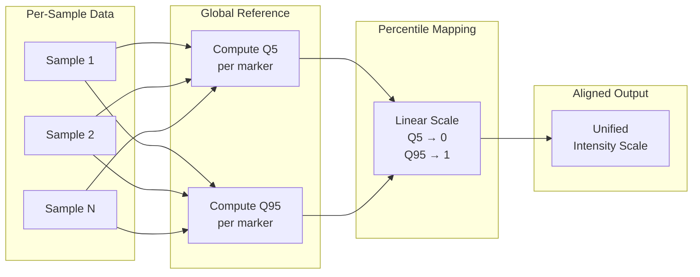

# Cross-Sample Alignment

Align marker intensities across samples.



## Method

Global percentile mapping using Q5 and Q95 reference values.

## CLI

```bash
celltype-refinery preprocess align \
  --input normalized/ \
  --out output/aligned
```
