# Batch Effect Correction

Remove technical variation while preserving biological effects.

```mermaid
flowchart TD
    subgraph Input
        A[Aligned Data]
    end

    subgraph Model["Linear Model"]
        direction TB
        B["Expression ~ Technical + Biological"]

        subgraph Tech["Technical (Remove)"]
            T1[Donor]
            T2[Imaging Color]
            T3[Imaging Cycle]
        end

        subgraph Bio["Biological (Preserve)"]
            B1[Marker]
            B2[Region]
            B3[Marker × Region]
        end
    end

    subgraph Output
        C[Corrected Data]
    end

    A --> B
    T1 --> B
    T2 --> B
    T3 --> B
    B1 --> B
    B2 --> B
    B3 --> B
    B --> C

    style Tech fill:#FFB6C1
    style Bio fill:#90EE90
```



## Technical Effects Modeled

- Donor effects
- Imaging color
- Imaging cycle

## Biological Effects Preserved

- Marker effects
- Region effects
- Marker-region interactions

## CLI

```bash
celltype-refinery preprocess batch \
  --input aligned/ \
  --mode residual \
  --out output/corrected
```
