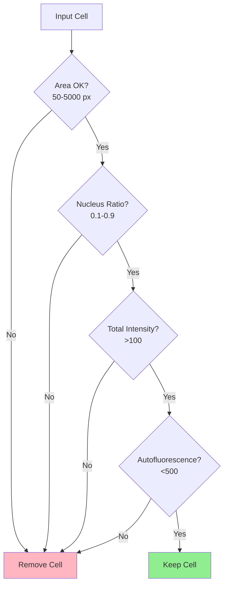

# Cell Quality Control

Remove low-quality cells based on morphology and intensity metrics.



## QC Criteria

| Metric | Default Threshold | Description |
|--------|-------------------|-------------|
| Cell area | 50-5000 px | Remove debris and doublets |
| Nucleus ratio | 0.1-0.9 | Nuclear/cell area ratio |
| Total intensity | \>100 | Minimum signal |
| Autofluorescence | \<500 | Maximum background |

## CLI

```bash
celltype-refinery preprocess qc \
  --input loaded/ \
  --max-removal 0.15 \
  --out output/filtered
```
