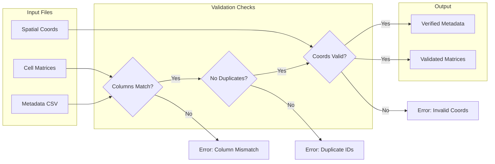

# Data Loading

Load and validate input data files.



## Supported Formats

- CSV cell matrices
- TSV metadata files
- H5AD AnnData objects

## Validation Checks

- Column consistency across samples
- Duplicate cell IDs
- Missing metadata fields
- Coordinate anomalies

## CLI

```bash
celltype-refinery preprocess load \
  --metadata metadata.csv \
  --out output/loaded
```
