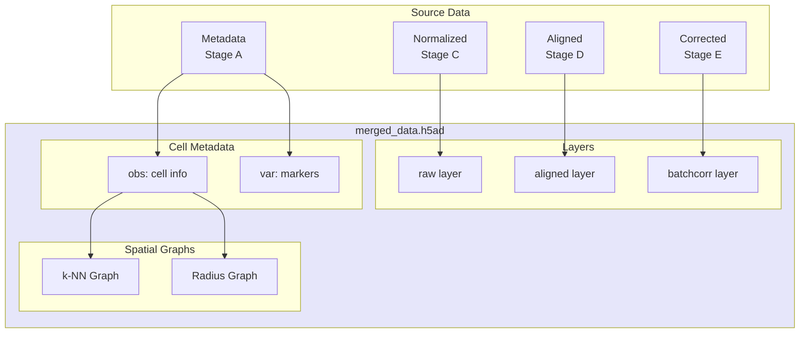

# Data Merging

Merge all samples into a unified AnnData object.



## Layers Created

| Layer | Source | Description |
|-------|--------|-------------|
| `raw` | Normalization | Normalized, not aligned |
| `aligned` | Alignment | Cross-sample aligned |
| `batchcorr` | Batch Correction | Batch-corrected |

## Spatial Graphs

Builds k-NN or radius-based spatial graphs for each sample.

## CLI

```bash
celltype-refinery preprocess merge \
  --input corrected/ \
  --graph-mode knn \
  --out output/merged.h5ad
```
