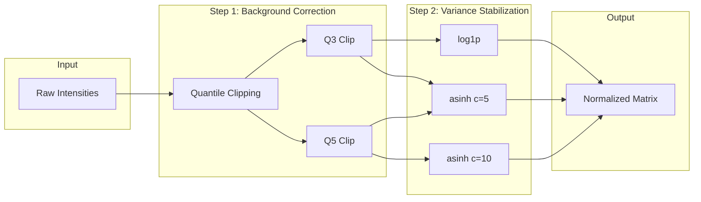

# Within-Sample Normalization

Normalize expression values within each sample.



**Default variant**: `clip-Q3__log1p` (Q3 clipping + log1p transform)

## Methods

### Background Correction

- Quantile-based clipping (Q3, Q5)
- Centering

### Variance Stabilization

- `asinh` transform (cofactor 5 or 10)
- `log1p` transform

## Default Variant

`clip-Q3__log1p`: Q3 quantile clipping + log1p transform

## CLI

```bash
celltype-refinery preprocess normalize \
  --input filtered/ \
  --method clip-Q3__log1p \
  --out output/normalized
```
