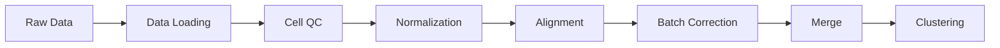

# Preprocessing Overview

The preprocessing module handles data loading, quality control, normalization, alignment, batch correction, and merging.

## Pipeline Position



## Stages

| Stage | Purpose | Input | Output |
|-------|---------|-------|--------|
| [Data Loading](data-loading) | Load and validate data | Raw matrices | Verified metadata |
| [Cell QC](cell-qc) | Remove low-quality cells | Cell matrices | Filtered matrices |
| [Normalization](normalization) | Within-sample normalization | Filtered data | Normalized data |
| [Alignment](alignment) | Cross-sample alignment | Normalized data | Aligned data |
| [Batch Correction](batch-correction) | Remove batch effects | Aligned data | Corrected data |
| [Data Merging](data-merging) | Merge into AnnData | All stages | `merged.h5ad` |

## CLI Usage

```bash
celltype-refinery preprocess \
  --input data/ \
  --config preprocess.yaml \
  --out output/preprocessed
```

## Python API

```python
from celltype_refinery.core.preprocessing import PreprocessingPipeline

pipeline = PreprocessingPipeline(config_path="preprocess.yaml")
adata = pipeline.run(input_dir="data/", output_dir="output/")
```
