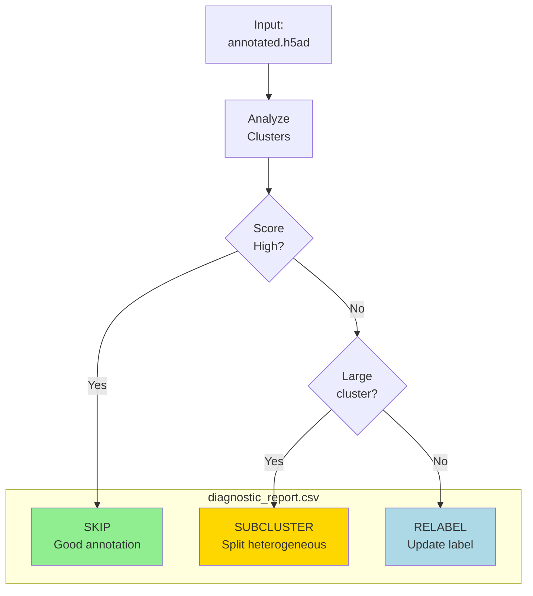

# Diagnostic Mode

Preview refinement recommendations without executing.



## Output

- `diagnostic_report.csv`: Per-cluster recommendations
- Recommendations: SUBCLUSTER, RELABEL, SKIP

## CLI

```bash
celltype-refinery refine \
  --input annotated.h5ad \
  --auto \
  --out output/diagnostic
```
