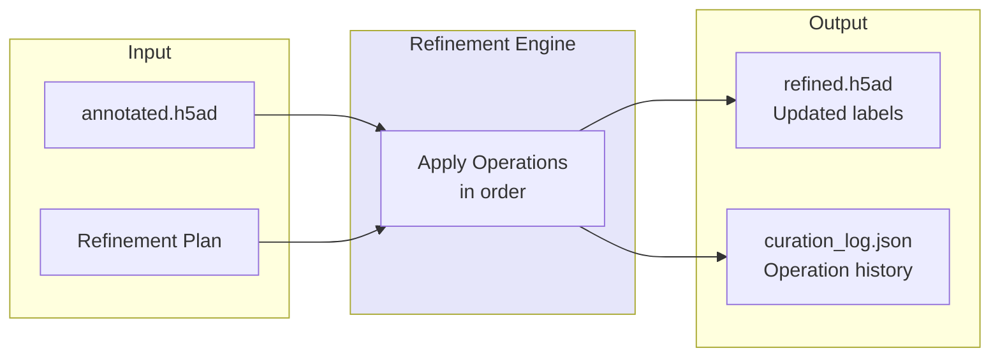

# Execution Mode

Apply refinement plans to the data.



## CLI

```bash
celltype-refinery refine \
  --input annotated.h5ad \
  --auto \
  --execute \
  --out output/refined
```

## Output

- `refined.h5ad`: AnnData with refined labels
- `curation_log.json`: Operation history
