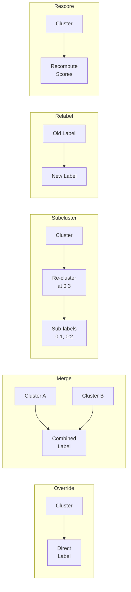

# Refinement Operations

Available operations in refinement plans.

## Operation Types

| Type | Description |
|------|-------------|
| Override | Direct label assignment |
| Merge | Combine clusters |
| Subcluster | Re-cluster at finer resolution |
| Relabel | Rename without re-clustering |
| Rescore | Recompute marker scores |
