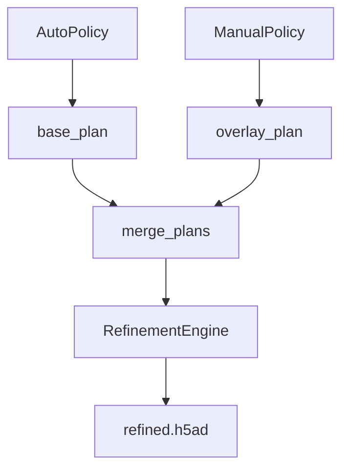

# Refinement Overview

The refinement module improves annotations through automatic and manual policies.

## Architecture

## Execution Modes

- **Diagnostic**: Generate recommendations only
- **Auto-only**: Automatic refinement
- **Manual-only**: YAML configuration
- **Hybrid**: Auto + manual overrides
